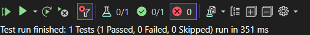

## **📜 Complete Guide for Integration Testing in .NET 8 From Sai Reddy Repo**
```md
# Integration Testing in .NET 8

This project demonstrates **Integration Testing** for an ASP.NET Core Web API using `xUnit` and `WebApplicationFactory`.

## **📌 Project Structure**
```
/SaiReddy_IntegrationRestAPI
 ├── SaiReddy_IntegrationRestAPI/           # API Project
 │   ├── Controllers/
 |       ├── EmployeeController.cs          # Sample API Controller
 │   ├── Program.cs                         # Entry point of the application
 │   ├── appsettings.json                   # Configuration settings
 │   ├── Employee                           # Model
 │   ├── SaiReddy_IntegrationRestAPI.csproj # Project file
 ├── xUnit_IntegrationTesting_SaiReddy/     # Test Project
 │   ├── EmployeeTests.cs                   # Integration Test
 │   ├── xUnit_IntegrationTesting_SaiReddy.csproj  # Test Project file
 ├── README.md                             # Documentation
```

---

## **🔧 Prerequisites**
- **.NET 8 SDK** installed
- **Visual Studio** or **VS Code**
- **Postman** (optional, for manual testing)

---

## **🚀 How to Run the API**
1. **Clone the Repository**  
   ```sh
   git clone https://github.com/SaiReddyA/SaiReddy_IntegrationTesting.Net_RESTAPI.git
   cd SaiReddy_IntegrationRestAPI
   ```

2. **Build and Run the API**
   ```sh
   dotnet build
   dotnet run
   ```

3. **Test in Browser/Postman**  
   Open:  
   ```
   https://localhost:5000/Employee/LoadEmployeeDetails
   ```

---

## **🛠️ Integration Testing Setup**
We use `xUnit` and `WebApplicationFactory` for integration testing.

### **1️⃣ Install Required Packages**
Run the following command:
```sh
dotnet add package Microsoft.AspNetCore.Mvc.Testing
dotnet add package xunit
```

### **2️⃣ Modify `Program.cs` for Testing**
Ensure `Program.cs` has this line:
```csharp
public partial class Program { } // Required for WebApplicationFactory
```

### **3️⃣ Create Test File (`EmployeeControllerTests.cs`)**
```csharp
public class EmployeeControllerTests : IClassFixture<WebApplicationFactory<Program>>
{
    private readonly HttpClient _client;

    public EmployeeControllerTests(WebApplicationFactory<Program> factory)
    {
        _client = factory.CreateClient();
    }

    [Fact]
    public async Task GetEmployee_ShouldReturnSuccessAndData()
    {
        try
        {
            // Act
            var response = await _client.GetAsync("/Employee/LoadEmployeeDetails");

            // Assert
            Assert.Equal(HttpStatusCode.OK, response.StatusCode);

            var result = await response.Content.ReadFromJsonAsync<dynamic>();
            Assert.NotNull(result);
        }
        catch(Exception)
        {
            throw;
        }
    }
}
```

---

## ** Running Integration Tests**
Run the test with:
```sh
dotnet test
```
With Shortcut keys in Visual studio 2022
```sh
ctrl+R,A
```

Expected output:
```
✓ EmployeeControllerTests.GetEmployee_ShouldReturnSuccessAndData [PASSED]
```

---

## ** Troubleshooting**
❌ **404 Not Found?**
- Check if your API is running.
- Ensure you're using the correct route (`/Employee/LoadEmployeeDetails`).

❌ **Program.cs not found?**
- Ensure `public partial class Program { }` is added.

